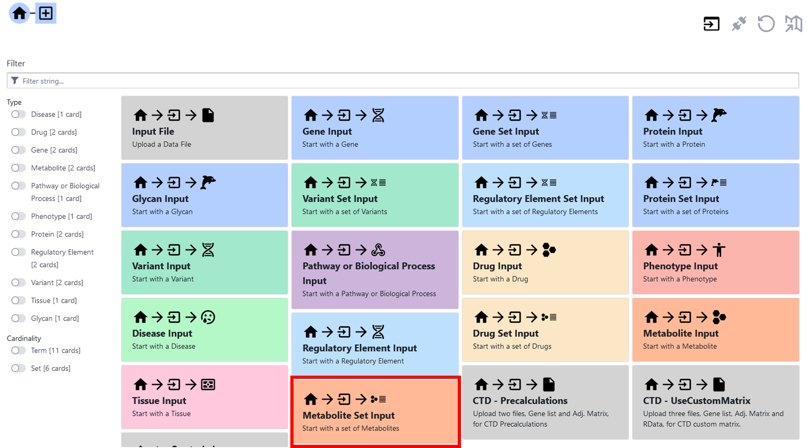
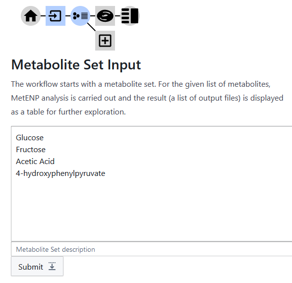
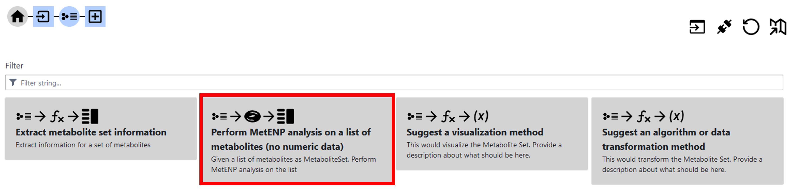
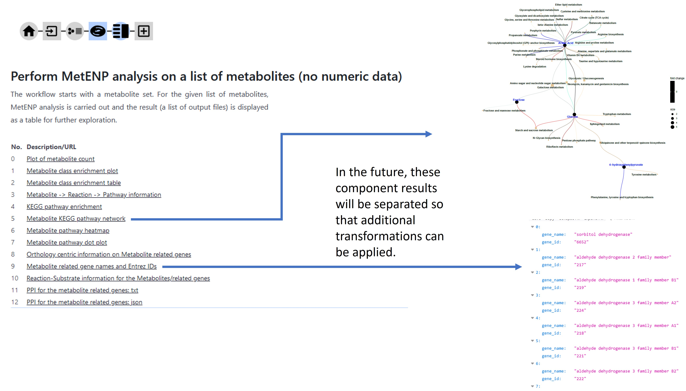

# MetNet User Guide

## What is MetNet (Metabolite enrichment, pathways and networks)?
Given a list of metabolites, e.g., metabolites with significant change between two conditions such as disease/normal or treatment/control in a metabolomics study, obtained by using MetENP (https://github.com/metabolomicsworkbench/MetENP) or another tool, a researcher may want to find what are the pathways and functions affected. MetENP provides a list of metabolic pathways affected, but it lacks information on signaling/regulatory pathways affected, e.g., using protein-protein interaction (PPI) information. MetNet, which is a metabolite-centric tool, bridges this gap. The user is advised to understand MetENP before using MetNet. MetNet uses several features from MetENP such as metabolite name harmonization using REFMET, metabolite class enrichment, metabolic pathway enrichment and visualization and identification of reactions related to the given metabolites and the genes (coding for enzymes) catalyzing these reactions. The list of genes thus obtained is used to develop their PPI network using STRING-DB APIs. Currently, MetNet is available as a REST API. The MetNet REST API provides HTTPS-based access to MetNet via a web-browser or scripts in several programming languages such as PHP, R, Python, that can handle HTTPS requests. The results are provided as a json object or a table with the columns like FileDescription and FileURL. The components of the results can be accessed following these URLs. It can be noted that the order of the parameters in the REST interface is fixed.

While the MetNet REST API can be used in stand-alone mode, it is best used through a workflow development tool such as the NIH Common Fund Data Ecosystem (CFDE) Workflow Builder Tool (WBT) available at https://playbook-workflow-builder.cloud  (see also https://github.com/nih-cfde/playbook-partnership/ and please note that some features of this API may be available only in a separate development instance available at WBT development page for Metabolomics Workbench). Downstream of the metabolite-related gene list, using the WBT, a researcher can develop gene regulatory networks and perform functional interpretation through pathway/gene set enrichment. The WBT also enables use of MetGENE tool (additional details provided at MetGENE website and SmartAPI for MetGENE), where, starting with one or more genes, the related reactions and metabolites can be identified. This list of metabolites and serve as an input to MetNet.

More information about the MetNet REST API, including the meaning of the parameters involved and how to use the API, is provided at its SmartAPI page (SmartAPI for MetNet).

## What are the features of MetNet?
If a user has quantitative metabolomics data, MetENP is a suitable tool. However, sometimes, the user may want to start with a known list of metabolites (e.g., those differentially altered between two conditions, as identified based on some statistical analysis). In this case, MetNet can be used to execute part of the MetENP pipeline, in particular, to identify in which reactions the metabolites are involved and what are the enzymes that catalyze those reactions. Further, a PPI for those genes can be developed. The results from MetNet consist of all these components as a list of (downloadable) files and their descriptions. 

## MetNet and Workflow Builder Tool
The MetNet REST API is integrated into the Playbook Workflow Builder Tool. Below, we provide an example of how the MetNet can be used in a workflow. The first step is to specify a metabolite (“Metabolite Input” card) or a set of metabolites (“Metabolite Set Input” card) as shown in Figure 1. 

Figure 1. Playbook Workflow Builder view at the start (the red box indicates the card selected to input a set of metabolites).

Next, we specify the list of metabolites (one per line) and click submit (Figure 2).

Figure 2. Submit a list of metabolites.

On the next screen (Figure 3), we get a list of applicable processes, out of which we select "Perform MetENP analysis on a list of metabolites (no numeric data)".

Figure 3. Select "Perform MetENP analysis on a list of metabolites (no numeric data)".

The results are available on the next screen (Figure 4). There are several components of the results, including "Metabolite class enrichment table", "Metabolite KEGG pathway network", "Metabolite related gene names and Entrez IDs", etc. This tool and API is a work in progress and more features, such as separating the different components of the results, will be added, so that other APIs available through the WBT can be used to expand the workflow constructed.

Figure 4. Results of MetENP analysis on the list of metabolites.

This workflow can be accessed at: https://playbook-workflow-builder.cloud/report/a8112809-1910-96b1-0891-98920eb3df8b.

## Learn More

[Find other topics in the Playbook Workflow Builder user guide](./index.md).
